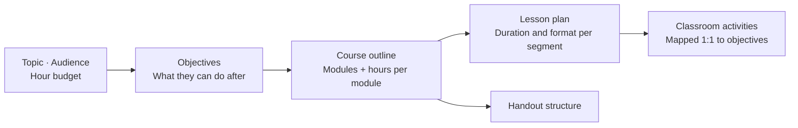

<div align="center">


# SOIA Open Edu Course Skills

**Define "what they can do afterwards" first, then work backwards to the content**

2 skills: course outlines and executable lesson plans. The minutes add up, and every module has a way to check it landed

[中文](README.md) · English · [Ecosystem portal](https://github.com/soia-team/soia-open-skills)

</div>

---

## What it solves

The easiest way to derail lesson prep: **pile up content first, discover the hours don't fit, and never be able to say what the students actually learned.** The order should be reversed — set the teaching objectives, then work backwards to content and practice.



## 2 skills

### 01 Course design　`Topic · audience · hours → outline, lesson plan, activities`

| Skill | Responsibility | Ready |
|---|---|:-:|
| [`soia-edu-design-course-outline`](https://github.com/soia-team/soia-open-skills/blob/main/docs/skills/soia-edu-design-course-outline.md) | Designs an outline from topic, audience and hour budget, with explicit objectives and hour allocation | ✅ |
| [`soia-edu-compose-lesson-plan`](https://github.com/soia-team/soia-open-skills/blob/main/docs/skills/soia-edu-compose-lesson-plan.md) | Writes an executable lesson plan, handout structure and classroom activities from the outline | ✅ |

✅ Both skills work right after install — no API key, no platform login

## Install

Any of three hosts. Installing the domain plugin brings both skills at once.

```bash
claude plugin marketplace add soia-team/soia-open-skills && claude plugin install soia-edu-course@soia
```

```bash
codex plugin marketplace add soia-team/soia-open-skills && codex plugin add soia-edu-course@soia
```

WorkBuddy is a desktop app with no CLI, so a skill does the work — tell your agent "install into WorkBuddy", or run:

```bash
python3 <soia-open-skills>/skills/soia-meta-skill-release/scripts/install_workbuddy_experts.py soia-edu-course
```

Restart the client, then summon **Soia · 课程设计师** under Experts → My Experts.

> **Always-on cost ~140 tok** — the lightest domain plugin in the ecosystem. Leaving it on costs almost nothing.
> For a single skill use npx: `npx skills add soia-team/soia-open-edu-course-skills -g -a '*' -s <skill-name> -y` — pick one route or the other; running both puts the same skill in the index twice and the copies drift apart.

## What it does not do

- **Does not invent academic citations or data.** When an authoritative source is needed, it says so and asks you to supply or verify it.
- **Does not promise learning outcomes.** What it produces is an executable structure, not a guarantee.
- **Does not render courseware.** Turning a lesson plan into slides, long images or quizzes belongs to the vault domain — see [soia-open-pkm-vault-skills](https://github.com/soia-team/soia-open-pkm-vault-skills).

## Contributing

Before committing a skill change:

```bash
python3 -m unittest discover -s tests -p 'test_*.py' && python3 scripts/audit_skills.py --strict && python3 scripts/generate_expert_manifest.py --check
```

Full workflow in the portal's [CONTRIBUTING.md](https://github.com/soia-team/soia-open-skills/blob/main/CONTRIBUTING.md).

## License

MIT — see [LICENSE](./LICENSE).
