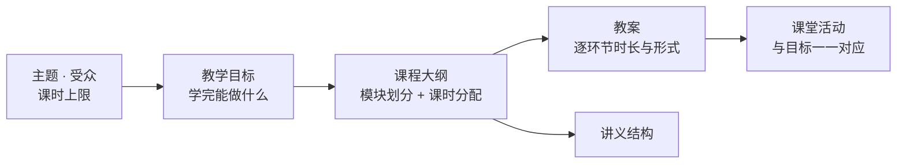

<div align="center">


# SOIA Open Edu Course Skills

**先定「学完能做什么」，再倒推讲什么**

2 个技能：课程大纲与可执行教案。课时算得过来，每个模块都有检验方式

[English](README.en.md) · 中文 · [全生态门户](https://github.com/soia-team/soia-open-skills)

<p align="center">
  
  
  
  
  
</p>

</div>

---

## 它解决什么

备课最容易跑偏的地方：**先堆内容，最后发现课时不够，也说不清学生到底学会了什么**。顺序应该反过来——先定教学目标，再倒推内容与练习。



## 2 个技能

### 01 课程设计　`主题 · 受众 · 课时 → 大纲、教案与课堂活动`

| 技能 | 职责 | 开箱 |
|---|---|:-:|
| [`soia-edu-design-course-outline`](https://github.com/soia-team/soia-open-skills/blob/main/docs/skills/soia-edu-design-course-outline.md) | 从主题、受众与课时约束设计大纲，明确教学目标与课时分配 | ✅ |
| [`soia-edu-compose-lesson-plan`](https://github.com/soia-team/soia-open-skills/blob/main/docs/skills/soia-edu-compose-lesson-plan.md) | 按大纲编写可执行教案、讲义结构与课堂活动 | ✅ |

✅ 两个技能装完即用，无需任何 API key 或平台登录

## 安装

三个宿主任选，装整个领域插件即 2 个技能一次到位。

```bash
claude plugin marketplace add soia-team/soia-open-skills && claude plugin install soia-edu-course@soia
```

```bash
codex plugin marketplace add soia-team/soia-open-skills && codex plugin add soia-edu-course@soia
```

WorkBuddy 是桌面端没有 CLI，由技能代劳——对 AI 说「装到 WorkBuddy」，或直接跑：

```bash
python3 <soia-open-skills>/skills/soia-meta-skill-release/scripts/install_workbuddy_experts.py soia-edu-course
```

装完重启客户端，在【专家中心 → 我的专家】召唤 **Soia · 课程设计师**。

> **常驻成本 ~140 tok**，全生态最轻的领域插件。常开着也几乎不占预算。
> 只想要单个技能可走 npx：`npx skills add soia-team/soia-open-edu-course-skills -g -a '*' -s <技能名> -y`——与插件二选一，并存会产生双份索引且各自漂移。

## 不负责什么

- **不编造学术引用与数据**。需要权威来源时会说明要你提供或另行查证。
- **不承诺教学效果**。产出的是可执行结构，不是效果保证。
- **不做课件渲染**。把教案转成 PPT、长图或试卷是知识库域的能力，见 [soia-open-pkm-vault-skills](https://github.com/soia-team/soia-open-pkm-vault-skills)。

## 贡献

改动技能后提交前跑：

```bash
python3 -m unittest discover -s tests -p 'test_*.py' && python3 scripts/audit_skills.py --strict && python3 scripts/generate_expert_manifest.py --check
```

完整流程见门户仓 [CONTRIBUTING.md](https://github.com/soia-team/soia-open-skills/blob/main/CONTRIBUTING.md)。

## License

MIT —— 见 [LICENSE](./LICENSE)。
